# Briefcast — Architecture Diagram

Paste the Mermaid code below into [mermaid.live](https://mermaid.live) to render and export as PNG/SVG.
It also renders automatically in GitHub README and Notion.

```mermaid
flowchart TD
    %% ─── SOURCES ───────────────────────────────────────────────
    subgraph T1["🔵 Tier 1 — Google Family"]
        direction LR
        G1[Google AI Blog]
        G2[Google Research]
        G3[Google DeepMind]
        G4[Google Cloud AI]
    end

    subgraph T2["⚪ Tier 2 — AI Labs"]
        direction LR
        S1[OpenAI]
        S2[Anthropic]
        S3[Meta AI]
        S4[Hugging Face]
        S5[Microsoft AI]
        S6[NVIDIA]
        S7[arXiv API]
    end

    %% ─── INGESTION ─────────────────────────────────────────────
    subgraph ING["⚙️ Ingestion Layer  ·  every 6h via APScheduler"]
        direction TB
        FETCH["feedparser + httpx\nRSS / Atom / arXiv API fetch"]
        L1["Dedup L1\nURL SHA-256 hash · O(1)"]
        KW["AI keyword filter\ntitle must match AI/ML terms"]
        L2["Dedup L2\nCosine similarity of title embedding\nthreshold 0.92 · window 500 recent"]
        CB["Circuit Breaker\n3 failures → degraded → Telegram alert"]

        FETCH --> L1 --> KW --> L2
        FETCH --> CB
    end

    %% ─── PROCESSING ────────────────────────────────────────────
    subgraph PROC["🧠 Processing Layer"]
        direction TB
        SUM["Gemini Flash · OpenRouter\nMode A: 3-sentence summary  |  Mode B: raw abstract arXiv"]
        EMB["nomic-embed-text-v1.5 · Nomic API\nEmbed summary → 768-dim vector"]
        DB[("PostgreSQL + pgvector\nurl · title · summary · embedding\nscore · dedup_hash · storage_mode")]

        SUM --> EMB --> DB
    end

    %% ─── RANKING ───────────────────────────────────────────────
    subgraph RANK["📊 Ranking Layer  ·  after every ingestion"]
        direction TB
        SCORE["score = tier×0.35 + recency×0.35 + novelty×0.30\nPairwise novelty via NumPy · O(n²)"]
        PERSIST["Persist scores → DB"]

        SCORE --> PERSIST
    end

    %% ─── BRIEFING ──────────────────────────────────────────────
    subgraph BRIEF["📅 Briefing Layer  ·  03:30 UTC · 09:00 IST"]
        direction TB
        SEL["Select top 10 articles\nmax 4 Google · max 2 per other company"]
        COMP["Claude Haiku · OpenRouter\nCompose Telegram HTML briefing"]
        TG_OUT["python-telegram-bot\nDeliver to @BrfCastBot"]

        SEL --> COMP --> TG_OUT
    end

    %% ─── RAG ────────────────────────────────────────────────────
    subgraph RAG["🔍 RAG Query Layer  ·  always-on · FastAPI"]
        direction TB
        WEBHOOK["Telegram Webhook\nPOST /telegram"]
        QEMB["nomic-embed-text-v1.5\nEmbed user query"]
        RETR["pgvector cosine search\nk=10 · 14-day rolling window"]
        GEN["Claude Sonnet · OpenRouter\nGrounded answer + inline citations"]
        TG_REPLY["Reply to Telegram chat"]

        WEBHOOK --> QEMB --> RETR --> GEN --> TG_REPLY
    end

    %% ─── INFRA ──────────────────────────────────────────────────
    subgraph INFRA["🚂 Infrastructure · Railway"]
        direction LR
        API["API Service\nFastAPI · always-on"]
        WORKER["Worker Service\nAPScheduler · cron"]
        OBS["Observability\nLangSmith tracing\nstructlog JSON + cost logging"]
    end

    %% ─── CONNECTIONS ────────────────────────────────────────────
    T1 -->|RSS| ING
    T2 -->|RSS / API| ING
    ING --> PROC
    DB --> RANK
    RANK --> BRIEF
    DB --> BRIEF
    DB --> RAG
    INFRA -.->|hosts| BRIEF
    INFRA -.->|hosts| RAG

    %% ─── STYLES ─────────────────────────────────────────────────
    classDef google fill:#e8f4fd,stroke:#4285f4,color:#1a1a1a
    classDef labs fill:#f0f0f0,stroke:#888,color:#1a1a1a
    classDef ingestion fill:#fff8e1,stroke:#f9a825,color:#1a1a1a
    classDef processing fill:#f3e5f5,stroke:#8e24aa,color:#1a1a1a
    classDef ranking fill:#e8f5e9,stroke:#2e7d32,color:#1a1a1a
    classDef briefing fill:#fce4ec,stroke:#c62828,color:#1a1a1a
    classDef rag fill:#e3f2fd,stroke:#1565c0,color:#1a1a1a
    classDef infra fill:#efebe9,stroke:#4e342e,color:#1a1a1a

    class T1,G1,G2,G3,G4 google
    class T2,S1,S2,S3,S4,S5,S6,S7 labs
    class ING,FETCH,L1,KW,L2,CB ingestion
    class PROC,SUM,EMB,DB processing
    class RANK,SCORE,PERSIST ranking
    class BRIEF,SEL,COMP,TG_OUT briefing
    class RAG,WEBHOOK,QEMB,RETR,GEN,TG_REPLY rag
    class INFRA,API,WORKER,OBS infra
```

