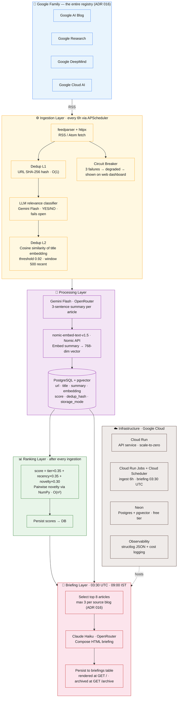

# 🗺️ Briefcast — Architecture Diagram

> Paste the Mermaid code below into [mermaid.live](https://mermaid.live) to render and export as PNG/SVG.
> Renders automatically in GitHub README and Notion.

```mermaid
flowchart TD
    %% ─── SOURCES ───────────────────────────────────────────────
    subgraph T1["🔵 Google Family — the entire registry (ADR 016)"]
        direction LR
        G1[Google AI Blog]
        G2[Google Research]
        G3[Google DeepMind]
        G4[Google Cloud AI]
    end

    %% ─── INGESTION ─────────────────────────────────────────────
    subgraph ING["⚙️ Ingestion Layer  ·  every 6h via APScheduler"]
        direction TB
        FETCH["feedparser + httpx\nRSS / Atom fetch"]
        L1["Dedup L1\nURL SHA-256 hash · O(1)"]
        KW["LLM relevance classifier\nGemini Flash · YES/NO · fails open"]
        L2["Dedup L2\nCosine similarity of title embedding\nthreshold 0.92 · window 500 recent"]
        CB["Circuit Breaker\n3 failures → degraded → shown on web dashboard"]

        FETCH --> L1 --> KW --> L2
        FETCH --> CB
    end

    %% ─── PROCESSING ────────────────────────────────────────────
    subgraph PROC["🧠 Processing Layer"]
        direction TB
        SUM["Gemini Flash · OpenRouter\n3-sentence summary per article"]
        EMB["nomic-embed-text-v1.5 · Nomic API\nEmbed summary → 768-dim vector"]
        DB[("PostgreSQL + pgvector\nurl · title · summary · embedding\nscore · dedup_hash · storage_mode")]

        SUM --> EMB --> DB
    end

    %% ─── RANKING ───────────────────────────────────────────────
    subgraph RANK["📊 Ranking Layer  ·  after every ingestion"]
        direction TB
        SCORE["score = tier×0.35 + recency×0.35 + novelty×0.30\nPairwise novelty via NumPy · O(n²)"]
        PERSIST["Persist scores → DB"]

        SCORE --> PERSIST
    end

    %% ─── BRIEFING ──────────────────────────────────────────────
    subgraph BRIEF["📅 Briefing Layer  ·  03:30 UTC · 09:00 IST"]
        direction TB
        SEL["Select top 8 articles\nmax 3 per source blog (ADR 016)"]
        COMP["Claude Haiku · OpenRouter\nCompose HTML briefing"]
        WEB_OUT["Persist to briefings table\nrendered at GET / · archived at GET /archive"]

        SEL --> COMP --> WEB_OUT
    end

    %% ─── INFRA ──────────────────────────────────────────────────
    subgraph INFRA["☁️ Infrastructure · Google Cloud"]
        direction LR
        API["Cloud Run\nAPI service · scale-to-zero"]
        JOBS["Cloud Run Jobs + Cloud Scheduler\ningest 6h · briefing 03:30 UTC"]
        NEON["Neon\nPostgres + pgvector · free tier"]
        OBS["Observability\nstructlog JSON + cost logging"]
    end

    %% ─── CONNECTIONS ────────────────────────────────────────────
    T1 -->|RSS| ING
    ING --> PROC
    DB --> RANK
    RANK --> BRIEF
    DB --> BRIEF
    INFRA -.->|hosts| BRIEF

    %% ─── STYLES ─────────────────────────────────────────────────
    classDef google fill:#e8f4fd,stroke:#4285f4,color:#1a1a1a
    classDef ingestion fill:#fff8e1,stroke:#f9a825,color:#1a1a1a
    classDef processing fill:#f3e5f5,stroke:#8e24aa,color:#1a1a1a
    classDef ranking fill:#e8f5e9,stroke:#2e7d32,color:#1a1a1a
    classDef briefing fill:#fce4ec,stroke:#c62828,color:#1a1a1a
    classDef infra fill:#efebe9,stroke:#4e342e,color:#1a1a1a

    class T1,G1,G2,G3,G4 google
    class ING,FETCH,L1,KW,L2,CB ingestion
    class PROC,SUM,EMB,DB processing
    class RANK,SCORE,PERSIST ranking
    class BRIEF,SEL,COMP,WEB_OUT briefing
    class INFRA,API,JOBS,NEON,OBS infra
```

> RAG query-back (embed query → pgvector search → Claude Sonnet answer) is
> parked, not diagrammed here — see [ADR 015](../decisions/015-park-rag-query-back.md)
> and [`archive/rag/`](../archive/rag/README.md).
